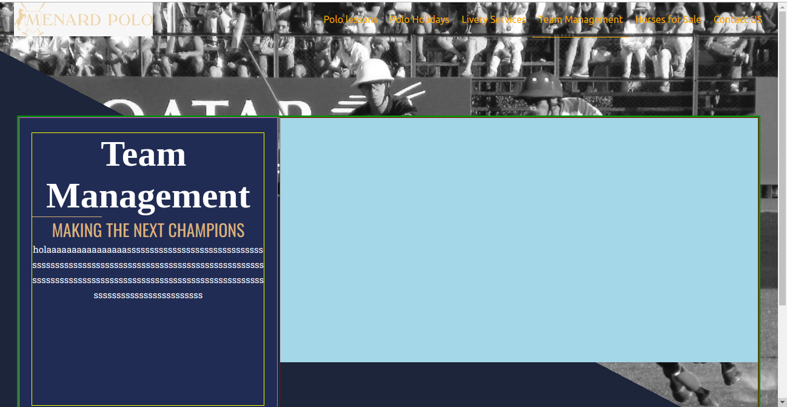

## Summary
Cree una barra de herramientas con direcciones a otras secciones de la pagina (navbar).

Problemas:
tuve problemas al intentar animar el cambio de estilo del nav en cada seccion.

Mejoras:

-Mejore el estilo de uso, en vez de usar Link en cada boton, se cambio a NavLink

-Se redujo codigo de seccion del menu, en vez de usar la etiqueta 'NavLink' en cada item, se imprime el menu mediante un array (lista) de objetos que contiene los datos que hara cada 'NavLink' y es recorrida por un 'map', sirve para ser re utilizado en caso de agregar mas secciones

Consideracion:

-agregarle animacion (translate) al estilo del NavLink al momento de cambiar de seccion

-Arreglar/cambiar el Logo del Menu

## Screenshots

